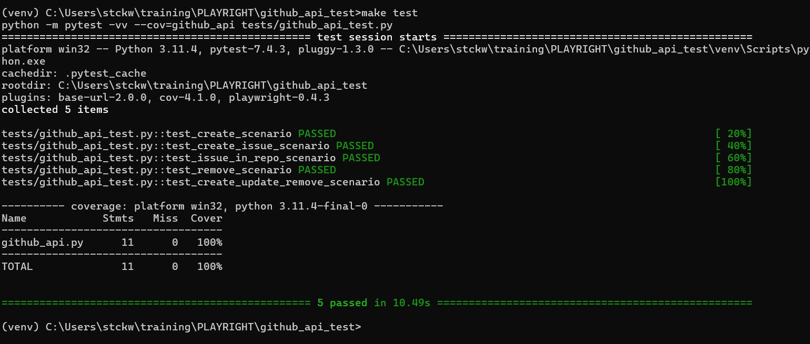

# github_api_test

GitHub API validation using Playwright

# Setup
Enviroment variables required by GitHub API calls

- API_TOKEN = os.getenv('API_PWRIGHT')
- USER_NAME = os.getenv('USER_NAME')

# Steps
- python -m venv venv
- source venv/bin/activate   (or .\venv\Scripts\activate for Windows)
- make install  (or make install_win)
- make lint
- make test

# Testing

1. Specify which pytest tests to run from a file (-k for keyword filtering)

   ```
    $ pytest tests/github_api_test.py -k test_create_scenario

   ```
2. Results


